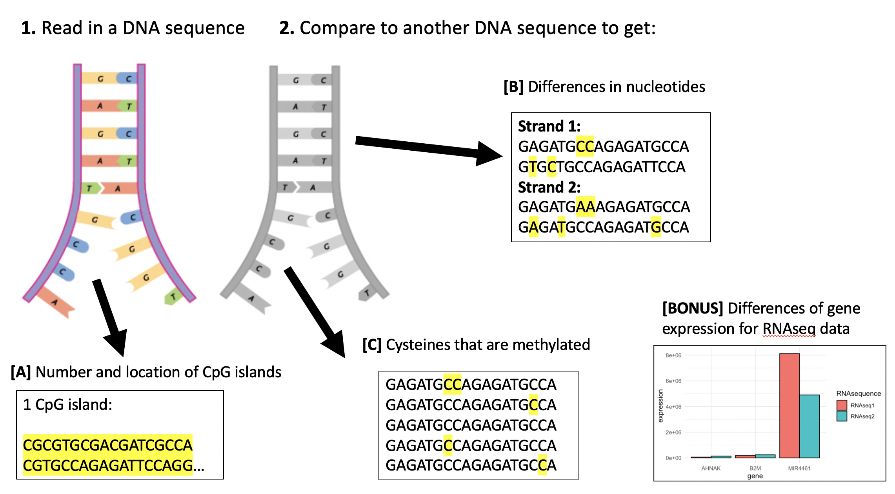

<!-- README.md is generated from README.Rmd. Please edit that file -->

# MethylExpress

<!-- badges: start -->

<!-- badges: end -->

## Description

The purpose of MethylExpress is to allow for visual investigation of
physical characteristics of methylation of DNA. Examples of this are
counting the amount of CpG islands that are present in a DNA strand and
highlighting where they are in the DNA strand, highlighting where
methylation occurs in a DNA strand, and graphically viewing the
differences in gene expression for two DNA strands with different
nucleotides being methylated.

This R package is unique from other R packages that deal with
methylation data as it allows for visual understanding and
interpretation of methylation data. While there are packages that, for
example, allow for the amount of CpG islands to be calculated for a
given DNA strand, there are no packages that allow the user to visually
see where in the DNA strand the CpG islands occur. Not only does this R
package allow for visualization, but it combines the ideas of other
package into a single package, while also adding more functionality\!

## Installation

To download the package:

``` r
require("devtools")
devtools::install_github("diannamcallister/MethylExpress", build_vignettes = TRUE)
library("MethylExpress")
```

To run the shinyApp:

``` r
MethylExpress::runMethylExpress()
```

## Overview

``` r
ls("package:MethylExpress")
data(package="MethylExpress")
```

There are **4** datasets that are able to be accessed by the user:

**1. PossibleCpGIslands** is a fabricated (fake) dataset, that is a DNA
strand in the form of a string of nucleotides, that can be used as an
example dataset to calculate the amount of CpG islands are present in a
DNA strand.

**2. MethylationObservation** is a dataset retrieved from a study
performed on *Ceratina calcarata* at the University of Georgia, where
mapping of methylation and quantification of gene expression was
completed (GSE111611). The DNA sequence before and after bisulfite
conversion are found in this dataset.

**3. BeforeBariatricSurgery** is a dataset retrieved from a study
performed at INSERM on overweight adults who would be recieving
bariatric surgery (GSE66306). This dataset includes the patients RNAseq
data before the surgery.

**4. AfterBariatricSurgery** is a dataset retrieved from a study
performed at INSERM on overweight adults who had recieved bariatric
surgery. (GSE66306).This dataset includes the patients RNAseq data after
the surgery.

There are **5** functions that are able to be accessed by the user:

**1. differencesInGeneExpression** allows for users to be able to
compare two different RNAseq data from two different DNA strands
(preferably with different methylation) and see the *n* genes with the
largest difference in expression between the two RNAseq datasets in a
graph. The user is able to specify *n*, which is the number of genes
shown in the graphical output.

**2. findCpGIslands** allows for users to be able to determine how many
CpG islands are present in their DNA strand, as well as view where the
CpG islands are in the DNA strand as this function will output the
nucleotides of the given strand with the CpG islands highlighted.

**3. findDifferencesInDNASequence** allows for users to be able to
determine which nucleotides between two strands of DNA are different.
This function will output the two DNA strands with the nucleotides that
differ between the strands highlighted.

**4. findMethylatedCytosines** allows for user to compare a DNA sequence
before and after bisulfite conversion, and determine which cytosine
nucleotides are methylated or not. This function will output the
original DNA strand (before bisulfite conversion) with the cytosines
that are methylated highlighted.

**5. runMethylExpress** allows for the user to run the shiny app for
MethylExpress so that they can interact with all of the functionalities
of the package through a GUI instead of the R commandline.

For more details about the functions, please take a look at the vignette
for this package:

``` r
browseVignettes("MethylExpress")
```

The package tree structure is provided below:

``` r
- MethylExpress
  |- MethylExpress.Rproj
  |- DESCRIPTION
  |- NAMESPACE
  |- LICENSE
  |- README
  |- data
    |- AfterBariatricSurgery.rda
    |- BeforeBariatricSurgery.rda
    |- MethylationObservation.rda
    |- PossibleCpGIslands.rda
  |- inst
    |- extdata
      |- MethylExpressOverview.png
    |- shiny-scripts
      |- app.R
  |- man
    |- AfterBariatricSurgery.Rd
    |- BeforeBariatricSurgery.Rd
    |- countCpGIslands.Rd
    |- differencesInGeneExpression.Rd
    |- DNASequenceHighlights.Rd
    |- findCpGIslands.Rd
    |- findDifferenceOfExpression.Rd
    |- findDifferencesInDNASequence.Rd
    |- findMatchingSections.Rd
    |- findMethylatedCytosines.Rd
    |- highlight.Rd
    |- MethylationObservation.Rd
    |- observedAndExpected.Rd
    |- PossibleCpGIslands.Rd
    |- runMethylExpress.Rd
  |- R
    |- data.R
    |- differencesInGeneExpression.R
    |- findCpGIslands.R
    |- findDifferencesInDNASequence.R
    |- findMethylatedCytosines.R
    |- runMethylExpress.R
  |- vignettes
    |- differencesInGeneExpressionExResult.png
    |- findCpGIslandsExResult.png
    |- findDifferencesInDNASequenceExResult.png
    |- findMethylatedCytosinesExResult.png
    |- MethylExpressVignette.Rmd
    |- runMethylatedExpressExResult.png
  |- tests
    |- testthat.R
    |- testthat
    |- test-DifferencesInGeneExpression.R
    |- test-FindCpGIslands.R
    |- test-FindDifferencesInDNASequence.R
    |- test-FindMethylatedCytosines.R
```

An overview of the package is illustrated below:


## Contributions

The author of this package is Dianna McAllister.

For the function **DifferencesInGeneExpression**, I use the R package
*ggplot2* to be able to plot the different amounts of gene expression.

For the functions **FindCpGIslands**, **FindDifferencesInDNASequence**,
and **FindMethylatedCytosines**, I use *rstudioapi* to be able to
display my markdown files (with the highlights) in the Rstudio Viewer
panel.

## References

H. Wickham. ggplot2: Elegant Graphics for Data Analysis. Springer-Verlag
New York, 2016.

Hunt, B. G. (2018). GEO Accession viewer. Retrieved November 17, 2020,
from <https://www.ncbi.nlm.nih.gov/geo/query/acc.cgi?acc=GSE111611>

Kevin Ushey, JJ Allaire, Hadley Wickham and Gary Ritchie (2020).
rstudioapi: Safely Access the RStudio API. *R package version 0.13*.
<https://CRAN.R-project.org/package=rstudioapi>

Poitou C, Perret C, Mathieu F, Truong V et al. Bariatric Surgery Induces
Disruption in Inflammatory Signaling Pathways Mediated by Immune Cells
in Adipose Tissue: A RNA-Seq Study. *PLoS One* 2015;10(5):e0125718.
PMID: 25938420

R Core Team (2019). R: A language and environment for statistical
computing. *R Foundation for Statistical Computing*, Vienna, Austria.
URL <https://www.R-project.org/>.

## Acknowledgements

This package was developed as part of an assessment for 2020 BCB410H:
Applied Bioinformatics, University of Toronto, Toronto, CANADA.
