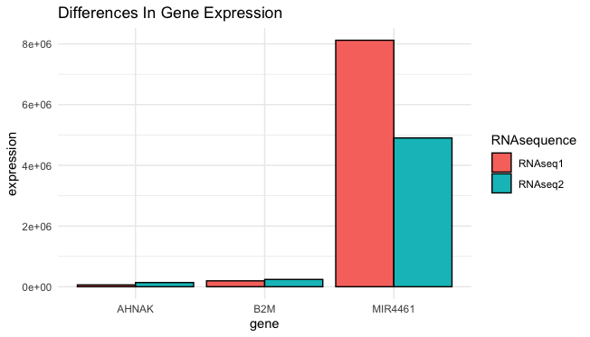
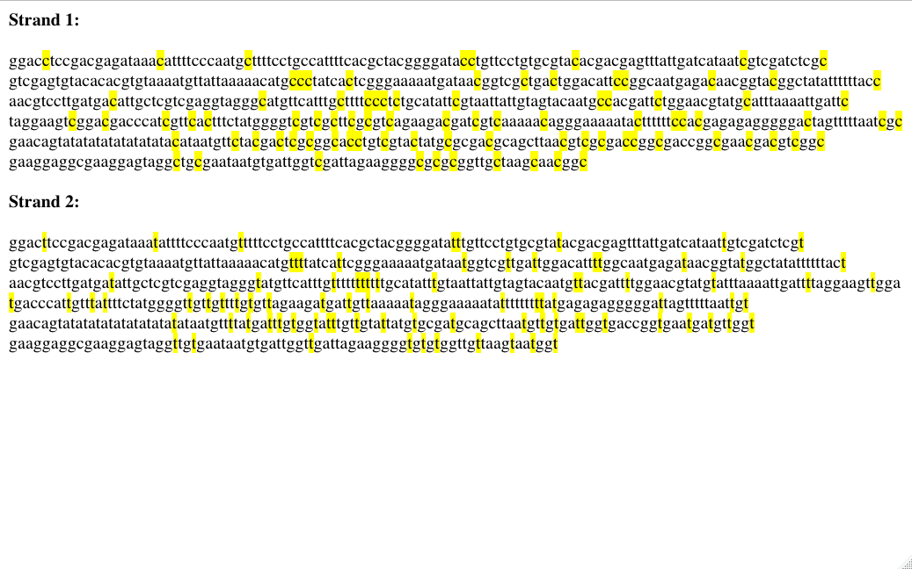
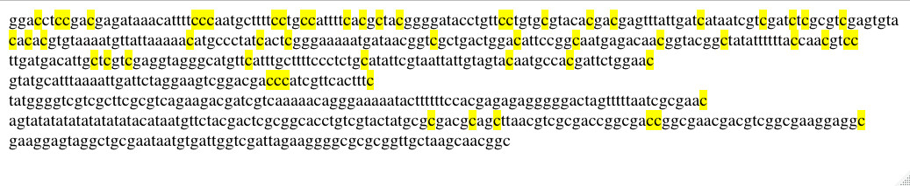

```{r, include = FALSE}
knitr::opts_chunk$set(
  collapse = TRUE,
  comment = "#>"
)
```

```{r setup}
library(MethylExpress)
```


## Summary

**MethylExpress** is an R package developed to allow for visual investigation of physical characteristics of methylation of the DNA, as well as how gene
expression can differ between DNA strands with different forms of methylation.
**This document gives a tour of MethylExpress (version 0.1.0)**. 
It was written in R Markdown, using the [knitr](https://cran.r-project.org/package=knitr) package for production. See `help(package = "MethylExpress")` for further details. 

To download **MethylExpress**, use the following commands:
``` {r eval=FALSE}
require("devtools")
install_github("diannamcallister/MethylExpress", build_vignettes = TRUE)
library("MethylExpress")
```

To list all sample functions available in the package:
``` {r eval=FALSE}
ls("package:MethylExpress")
```

To list all sample datasets available in the package:
``` {r eval=FALSE}
data(package = "MethylExpress")
```

<br>

## Functions

More details about the 4 functions available:

### 1. DifferencesInGeneExpression

#### Summary of the function

**DifferencesInGeneExpression** allows for users to be able to compare two
different RNAseq data from two different DNA strands (preferably with 
different methylation) and see the *n* genes with the largest difference in 
expression between the two RNAseq datasets in a graph. The user is able to 
specify *n*, which is the number of genes shown in the graphical output.

The format of the input should be two RNAseq dataframes, where each RNAseq 
dataframe has the first column as the name of the genes, and the second column
is the expression of each gene. In addition, the genes from both RNAseq
dataframes should be found in the same order to be compared properly (ex:
if gene A is the first row of RNAseq1, it should also be the first row in
RNAseq2). The two RNAseq dataframes must also include the same amount of genes
(aka rows) in their dataframes.

There is one helper function (*findDifferencesInGeneExpression*) that finds 
the *n* largest difference in expression genes between the two RNAseq 
dataframes. This helper function passes these genes (and their expressions) 
back to the main function, who then graphs the genes expressions in a bar 
graph.

#### How to use the function

**Parameter Format / Examples**

First, we will take a look at the parameters that this function uses. This
function takes in two dataframes, where the first column is the gene name and
the second column is the count value for the gene's expression. Two examples
of the type of dataframe that could be used for this function can be found 
within the MethylExpress package, called *BeforeBariatricSurgery* and
*AfterBariatricSurgery*.

This function also takes in an integer value, representing the number of genes
that want to be displayed in the output bar graph. The genes that will be
displayed are those with the largest differences in expression between the two
dataframes given. So for example, if you chose to use the integer 1, only the
gene with the largest difference in expression between the two RNA seq count
expressions.

**Example of Using the Function**

Now, we will perform an example of using this function with dataframes that
are already found in the MethylExpress package!

We will be comparing gene expression before and after bariatric surgery. To
do this, we have the two dataframes *BeforeBariatricSurgery* and 
*AfterBariatricSurgery* in the MethylExpress package!

Then, we will choose to see the top three genes with the largest difference
in gene expression:

``` {r eval=FALSE}
MethylExpress::differencesInGeneExpression(BeforeBariatricSurgery, AfterBariatricSurgery, 3)
```



Now, the bar graph displaying the gene expressions for the three genes with 
the largest difference in count expression before and after are displayed in
the bar graph above!

### 2. FindCpGIslands

#### Summary of the function

**FindCpGIslands** allows for users to be able to determine how many CpG
islands are present in their DNA strand, as well as view where the CpG islands
are in the DNA strand as this function will output the nucleotides of the
given strand with the CpG islands highlighted.

The format of the input should be a string of nucleotides, representing a 
DNA strand.

It is important to note that a CpG island is present if there are 200 or more
nucleotides that have at least 50% of the nucleotides as C and/or G, and that
the observed CpG (CG right next to eachother in the sequence) divided by the
expected CpG 
[(number of cytosine nucleotides + number of guanine nucleotides) / length of stretch of nucleotides] is greater than or equal to 60%.

There are a few helper functions for this function. To begin, 
*countCpGIslands* keeps track of how many CpG islands are found within the
DNA strand, as well as the location in the strand of each island. This 
information will be relayed to the main function, who will tell the user
how many CpG islands are found in the DNA strand, as well as indicate where
(with highlights) in the DNA strand the CpG islands are. Another helper 
function is called *observedAndExpected*, which keeps track of the CG ratio
in the DNA strand, and the observed:expected ratio of CpG islands in the 
strand. Finally, the *highlight* helper function is used to create html
markdown to highlight the CpG islands within the DNA.

#### How to use the function

**Parameter Format / Examples**

First, we will take a look at the parameters that this function uses. This
function takes in a string which should only include proper nucleotides (ex:
a, t, c, g). An example of the type of string that could be used for this 
function can be found within the MethylExpress package, called 
*PossibleCpGIslands*.

**Example of Using the Function**

Now, we will perform an example of using this function with a string that
is already found in the MethylExpress package!

We will be using an artificially made (not true data) string called
*PossibleCpGIslands* which can be found in the MethylExpress package:

```{r eval=FALSE}
MethylExpress::findCpGIslands(PossibleCpGIslands)
```

{width=90%}

Now, the string from *PossibleCpGIslands* is outputted above, with
the CpG islands highlighted! This function also outputs the number of CpG 
islands found in the input DNA strand - in the example above, there would be
2 CpG islands!

### 3. FindDifferences In DNA Sequence

#### Summary of the function

**FindDifferencesInDNASequence** allows for users to be able to determine
which nucleotides between two strands of DNA are different. This function will
output the two DNA strands with the nucleotides that differ between the strands
highlighted.

The format of the input is two strings of nucleotides that represent two
DNA strands.

The *highlight* helper method mentioned in function 2 will be used to aid in
highlighting the nucleotides that don't match between the two DNA strands as
well as the *DNASequenceHighlight* method will be used to determine which
nucleotides in the DNA strand should be highlighted.

#### How to use the function

**Parameter Format / Examples**

First, we will take a look at the parameters that this function uses. This
function takes in two strings, which should only include proper nucleotides (ex:
a, t, c, g). Two examples of the type of strings that could be used for this 
function can be found within the MethylExpress package, called 
*MethylationObservation$originalDNA* and *MethylationObservation$bisulfite*.

**Example of Using the Function**

Now, we will perform an example of using this function with strings that
are already found in the MethylExpress package!

We will be comparing strings of nucleotides from a DNA strand before and after
bisulfite conversion. To do this, we have the two strings
*MethylationObservation$originalDNA* and *MethylationObservation$bisulfite*
in the MethylExpress package!

``` {r eval=FALSE}
MethylExpress::findDifferencesInDNASequence(MethylationObservation$originalDNA, MethylationObservation$bisulfite)
```

{width=90%}

Now, the strings from *MethylationObservation* are outputted above, with
the nucleotides that differ between the two highlighted!

### 4. FindMethylatedCytosines

#### Summary of the function

**FindMethylatedCytosines** allows for user to compare a DNA sequence 
before and after bisulfite conversion, and determine which cytosine 
nucleotides are methylated or not. This function will output the original DNA 
strand (before bisulfite conversion) with the cytosines that are methylated 
highlighted.

The format of the input is two strings of nucleotides that represent two
DNA strands. One strand should be before bisulfite conversion, and the other
strand should be after bisulfite conversion.

It is important to note that bisulfite conversion is used for methylation 
analysis since after bisulfite conversion, any cytosine that is not methylated
will be converted into a thymine. If a cytosine is methylated, then after
bisulfite conversion it will be remain a cytosine. Therefore, by comparing
cytosines before and after bisulfite conversion, it is possible to distinguish
which cytosines are methylated.

The *findMatchingSections* helper function will help to determine which 
cytosines are not methylated (have been converted to thymine) and which 
cytosines are methylated. The *highlight* helper function will then highlight
all cytosines that are methylated, and will pass this information to the main
function, which will display the highlighted DNA strand.

#### How to use the function

**Parameter Format / Examples**

First, we will take a look at the parameters that this function uses. This
function takes in two strings, which should only include proper nucleotides (ex:
a, t, c, g). The first string should be nucleotides of a DNA strand as it 
usually appears (before bisulfite conversion), and the second string should be
nucleotides of a DNA strand as it appears after bisulfite conversion. Examples
of the type of strings that could be used for this 
function can be found within the MethylExpress package, called 
*MethylationObservation\$originalDNA* and *MethylationObservation\$bisulfite*.

**Example of Using the Function**

Now, we will perform an example of using this function with strings that
are already found in the MethylExpress package!

We will be comparing strings of nucleotides from a DNA strand before and after
bisulfite conversion. To do this, we have the two strings
*MethylationObservation\$originalDNA* and *MethylationObservation\$bisulfite*
in the MethylExpress package!

```{r eval=FALSE}
MethylExpress::findMethylatedCytosines(MethylationObservation$originalDNA, MethylationObservation$bisulfite)
```

{width=90%}

Now, the string before bisulfite conversion from *MethylationObservation* 
(*MethylationObservation\$originalDNA*) is outputted above, with
the cytosines that are methylated highlighted!

## Package References

[McAllister, D. (2020) MethylExpress: An R Package For
  BCB410H. Unpublished.](https://github.com/diannamcallister/MethylExpress)

<br>

## Other References

H. Wickham. ggplot2: Elegant Graphics for Data Analysis. Springer-Verlag New York, 2016.

Hunt, B. G. (2018). GEO Accession viewer. Retrieved November 17, 2020, from https://www.ncbi.nlm.nih.gov/geo/query/acc.cgi?acc=GSE111611

Kevin Ushey, JJ Allaire, Hadley Wickham and Gary Ritchie (2020). rstudioapi: Safely Access the RStudio API. R package version 0.13. https://CRAN.R-project.org/package=rstudioapi

Poitou C, Perret C, Mathieu F, Truong V et al. Bariatric Surgery Induces Disruption in Inflammatory Signaling Pathways Mediated by Immune Cells in Adipose Tissue: A RNA-Seq Study. PLoS One 2015;10(5):e0125718. PMID: 25938420

R Core Team (2019). R: A language and environment for statistical computing. R Foundation for Statistical Computing, Vienna, Austria. URL https://www.R-project.org/.

----

```{r}
sessionInfo()
```
